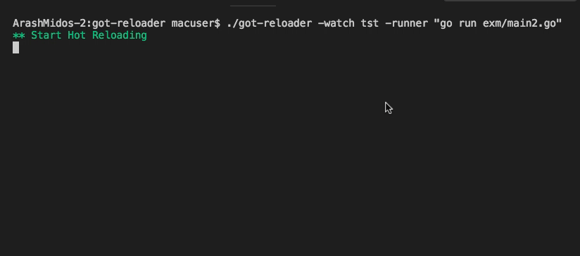

# got-reloader
hot reloader for golang projects
usage   
it uses a 1 second timer to hash folder and check it's hash with previos   
if hash chaned, it will kill child process and start command again   
if command crash it wait for next reload   s

```sh
got-reloader -watch . -runner "go run exm/main2.go"
```
